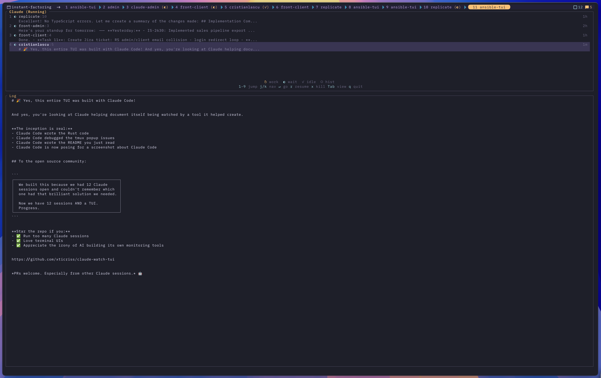

# claude-watch

A fast, beautiful TUI for monitoring and managing your [Claude Code](https://docs.anthropic.com/en/docs/claude-code) sessions in tmux.




## Why?

If you're running multiple Claude Code sessions across different projects, keeping track of them becomes challenging. **claude-watch** gives you a bird's-eye view of all your sessions:

- See which sessions are **thinking**, **waiting**, or **idle** at a glance
- Jump to any session with a single keypress
- Resume historical sessions instantly
- Kill runaway processes without hunting for PIDs
- Never lose track of that brilliant conversation you started yesterday

## Features

- **Real-time status** — See what Claude is doing right now (thinking, processing, waiting for input)
- **Session history** — Browse and resume past sessions from `sessions-index.json`
- **Tmux integration** — Jump directly to any session's tmux window
- **Resume anywhere** — Start a new tmux window with `claude --resume` for any session
- **Log viewer** — See recent conversation context for the selected session
- **Keyboard-driven** — Vim-style navigation, number shortcuts, everything at your fingertips
- **Beautiful UI** — Rose Pine Moon color theme, minimal and focused

## Installation

### From source (recommended)

```bash
# Clone the repository
git clone https://github.com/xticriss/claude-watch-tui.git
cd claude-watch-tui

# Build and install
cargo build --release
cp target/release/claude-watch ~/.local/bin/

# Or install directly with cargo
cargo install --path .
```

### Requirements

- Rust 1.70+
- tmux (for session management)
- Claude Code CLI installed and configured

## Usage

```bash
# Launch the TUI
claude-watch

# Or bind to a tmux key (add to ~/.tmux.conf)
bind-key C-c display-popup -E -w 80% -h 80% "claude-watch"
```

### Keybindings

| Key | Action |
|-----|--------|
| `j` / `↓` | Move down |
| `k` / `↑` | Move up |
| `1-9` | Jump to session by number |
| `Enter` | Go to session (switch to tmux window or resume) |
| `r` | Resume session in new tmux window |
| `x` | Kill selected session |
| `Tab` | Toggle between Running / All sessions |
| `R` | Refresh session list |
| `q` / `Esc` | Quit |

### Status Icons

| Icon | Meaning |
|------|---------|
| `↻` (gold) | Thinking — Claude is generating a response |
| `↻` (blue) | Processing — Executing tools |
| `◐` | Waiting — Ready for your input |
| `✓` | Idle — Session quiet |
| `○` | Historical — Not currently running |

### Views

- **Running** (default) — Only shows active Claude processes
- **All** — Shows running + last 20 historical sessions

Press `Tab` to toggle between views.

## How it works

claude-watch detects Claude Code sessions by:

1. Finding `claude` processes via the system process list
2. Matching them to project directories in `~/.claude/projects/`
3. Parsing JSONL session files to extract status and recent messages
4. Cross-referencing with tmux panes for window locations
5. Reading `sessions-index.json` for historical session metadata

## Configuration

No configuration needed! claude-watch automatically finds your Claude sessions and tmux windows.

### Recommended tmux setup

Add to your `~/.tmux.conf` for quick access:

```bash
# Alt+C to open claude-watch in a popup
bind-key -n M-c display-popup -E -w 80% -h 80% "claude-watch"
```

## JSON output

For scripting, use the `--list` flag to get sessions as JSON:

```bash
claude-watch --list
```

## Contributing

Contributions are welcome! Feel free to:

- Report bugs or request features via [Issues](https://github.com/xticriss/claude-watch-tui/issues)
- Submit pull requests
- Share how you use claude-watch in your workflow

## License

MIT License — see [LICENSE](LICENSE) for details.

## Acknowledgments

- Built with [Ratatui](https://ratatui.rs/) — the Rust TUI framework
- Inspired by the need to wrangle too many Claude conversations at once
- Color theme: [Rosé Pine Moon](https://rosepinetheme.com/)

---

*Made with Claude Code, naturally.*
